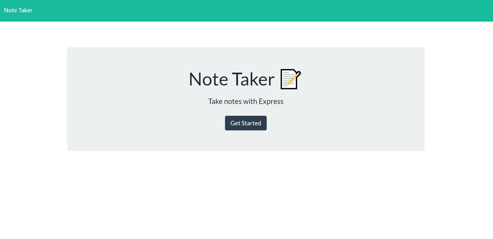

# note-taker
By: Garrett Reichman 
 
https://stormy-wave-49425.herokuapp.com/

## Description
This application was made to not only practice using express servers, but also to experience writing the back-end code for a project where I had little to do with writing the front-end. It uses express to run the server code, and uses fs and uniqid to handle the creating and deleting of notes.
## Usage

    To use the app, vist the site linked above. Upon arrival, click the "Get Starded" button to view the note page.

On this page, you have the options of creating new notes, viewing old notes, and deleting any previously created notes. To create a new note,  click the pencil icon in the top right, then fill in the title and text fields. Once finished, click the save icon to create the note. To view a note, click on one of the notes in the list on the left side of the page. This will display the note's title and contents to the right side of the page. To delete a note, click the red trash can icon on the right side of the note. This will remove it from the server then reload the page with the remaining notes.
